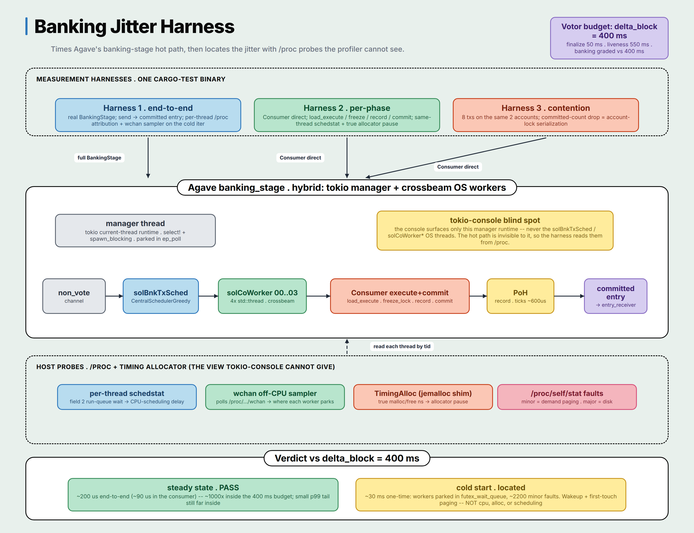

# Banking Jitter Harness

A measurement harness that times Agave's banking-stage / consumer hot path against
Alpenglow Votor's per-round budget, and classifies the timing jitter into the buckets
the lab asks for: CPU-scheduling delay, I/O stall, and allocator pause.

Built as a workspace crate inside Agave, pinned to commit `f8bc56e` (master,
`4.2.0-alpha.0`).

## TL;DR result

- Steady-state banking is ~200 us end to end and ~90 us inside the consumer:
  comfortably inside Votor's 400 ms block budget, with roughly 1000x headroom.
  Steady state still carries a small p99 tail (~1 ms vs ~200 us median), itself
  well inside budget.
- The dominant jitter is a one-time **cold start**, ~30 ms on the first end-to-end
  iteration. The harness measures what causes it rather than guessing, and the
  evidence rules out the obvious explanations:
  - Not Agave CPU: during the ~30 ms cold window, all Agave worker threads combined
    use under 1 ms of CPU (per-thread `schedstat`, end-to-end harness).
  - Not scheduling (run-queue wait ~0) and not disk (major page faults 0).
  - Not the allocator: near-zero worker CPU leaves no room for malloc time on the
    end-to-end path, and the per-phase harness confirms it directly -- a timing
    allocator shows ~10 us of malloc/free on the consumer's cold iteration vs ~9 us
    steady. (That is the consumer's own ~0.4 ms cold start, measured directly, not
    the ~30 ms end-to-end one.)
  - What is elevated: ~2200 minor page faults (first-touch demand paging) vs ~170
    steady.
- Diagnosis (located, not inferred): an off-CPU `wchan` sampler shows all ~30 banking
  worker threads parked in `futex_wait_queue` for the full cold window with ~0 CPU,
  the manager thread in `ep_poll`, and only PoH ticking (~600 us). The cold start is
  parked-thread wakeup / first-message latency plus first-touch paging, not
  computation, allocation, or scheduling. (The manager sitting in `ep_poll` also
  independently confirms the hybrid tokio-plus-OS-threads architecture below.)

## Architecture diagram



How to read it, top to bottom:

1. **Harnesses (entry points).** The three runs share one `cargo test` binary.
   Harness 1 sends a packet into a real `BankingStage` and times the full pipeline;
   Harnesses 2 and 3 bypass the threading and call the `Consumer` directly, so the
   same-thread probes attribute cleanly.
2. **System under observation.** `banking_stage` is a hybrid: a tokio manager thread
   (control plane, parked in `ep_poll`) sitting over a data-plane pipeline of plain
   OS threads on crossbeam channels -- `non_vote` channel -> `solBnkTxSched` scheduler
   -> `solCoWorker00..03` -> `Consumer` (load_execute / freeze_lock / record / commit)
   -> PoH -> committed entry. The yellow callout is the tokio-console blind spot: the
   console surfaces only the manager, never the OS workers.
3. **Host probes.** Because the workers are invisible to tokio-console, the harness
   reads every thread from `/proc` plus a timing allocator -- per-thread `schedstat`
   (CPU-scheduling delay), a `wchan` off-CPU sampler (where each worker parks), the
   `TimingAlloc` shim (true malloc/free pause), and `/proc/self/stat` faults (demand
   paging vs disk). Each probe maps to one jitter bucket.
4. **Verdict vs delta_block = 400 ms.** Steady-state banking is ~1000x inside budget;
   the one-time cold start is futex wakeup plus first-touch paging, not computation,
   allocation, or scheduling.

The rest of this README is the detail behind each box.

## Process: how this was built

1. **Read the paper for the timing.** Pulled the Votor per-round timing out of the
   Alpenglow v1.1 whitepaper: a block must reach finalization within `min(delta_80,
   2*delta_60)` (fast path one round at >=80% stake, slow path two rounds at >=60%),
   with block production bounded by `delta_block = 400 ms`. Recorded the exact figure
   and section the numbers come from.
2. **Picked the deadline that applies to banking.** Votor does not run in Agave yet
   (TowerBFT does), so the harness uses the budget as an SLA: the banking stage is
   graded against `delta_block = 400 ms`, with the finalization and liveness numbers
   reported for context.
3. **Pinned the system under observation.** Cloned Agave at `f8bc56e` and built the
   harness as a workspace crate against the real `core/src/banking_stage.rs`.
4. **Discovered the architecture.** Found that `banking_stage.rs` is a hybrid: a tokio
   manager runtime plus plain OS worker threads on crossbeam channels. This is the key
   to everything downstream.
5. **Hit the tokio-console blind spot.** Wired `tokio-console` (above) and confirmed it
   only surfaces the manager, not the OS workers. So it cannot trace the hot path here.
6. **Built thread-agnostic probes instead.** Per-thread `schedstat`, per-thread context
   switches, a `wchan` off-CPU sampler, page-fault counts, and a timing-allocator shim
   for true malloc pause time -- so jitter can be split into CPU-scheduling vs I/O vs
   allocator with evidence.
7. **Measured and located the jitter.** Found that steady-state banking is ~1000x inside
   budget and the dominant jitter is a one-time cold start (steady state keeps a small
   p99 tail, still far inside budget), then attributed that cold start to futex/wakeup
   latency (not CPU, allocation, or scheduling) using the probes.

## Votor budget: where the deadline comes from

Source: Alpenglow White Paper v1.1, **Figure 7** (p22, Votor per-round lifecycle).
The numeric bounds are in the abstract, Section 1.5, Table 6, and Definition 17.

| Quantity | Meaning | Value |
|---|---|---|
| `delta_block` | Normal block-production time. **What banking is judged against.** | 400 ms |
| `delta` | One all-to-all message delay among a >=theta-stake node set (assumed). | 50 ms |
| finalization | `min(delta_80, 2*delta_60)`, fast path vs slow path, min wins. | min(50, 100) = 50 ms |
| liveness ceiling | `Timeout(i) = 3*delta + delta_block`. Give-up line, **not** a target. | 550 ms |

The harness grades the banking stage against `delta_block = 400 ms`. The 550 ms
`Timeout` is a liveness ceiling, not the common-case latency goal, so it is reported
for context only. `delta` is an assumption, so the report also sweeps it across
25 / 50 / 100 ms to show how the finalization and liveness numbers move.

Votor does not run in Agave today (Agave uses TowerBFT); the harness borrows Votor's
budget as a deadline and measures real banking code against it.

## Harnesses

### 1. `measure_banking_stage_slot_timing` -- end to end + worker attribution

Drives a real `BankingStage` (CentralSchedulerGreedy, 4 workers) and times send to
committed entry. On the cold iteration and one steady iteration it snapshots **every
Agave thread's `schedstat`** (on-CPU ns, run-queue-wait ns) and **per-thread context
switches** (`/proc/self/task/<tid>/status`), plus process page faults. On the cold
iteration it additionally runs an **off-CPU `wchan` sampler**: a background thread
polls each worker's `/proc/self/task/<tid>/wchan` and tallies where it is parked, so
the residual wakeup wait is located (a futex / channel wait) rather than guessed. This
is the answer to the tokio-console blind spot (below): the OS worker threads it cannot
see are read directly from `/proc`.

### 2. `measure_pre_phase_slot_timing` -- per phase + true allocator pause

Drives the `Consumer` directly via `process_and_record_transactions`, which runs
synchronously on the calling thread, and reads Agave's own
`LeaderExecuteAndCommitTimings` (`load_execute`, `freeze_lock`, `record`, `commit`).
Two same-thread probes wrap the call: run-queue-wait from `schedstat`, and **true
allocator pause time** from the timing allocator (see below).

### 3. `measure_account_lock_contention` -- the real contention signal

Submits a batch of transactions that all write the same two accounts. Account-lock
contention shows up as a drop in committed count (the conflicting subset is serialized
out), **not** as `freeze_lock` time. This corrects an earlier framing: `freeze_lock`
guards the bank freeze RwLock, a different lock that stays ~0 without a concurrent
freezer.

## Jitter taxonomy: how each bucket is measured

- **CPU-scheduling delay** -- field 2 of `schedstat` is the nanoseconds a thread spent
  *runnable but waiting on a run-queue*. Read per-thread (Harness 1) and same-thread
  (Harness 2).
- **Allocator pause (true pause time)** -- the test binary's `#[global_allocator]` is a
  `TimingAlloc` shim that wraps jemalloc. A per-thread flag enables timing only around
  the measured region, so every Agave worker pays just a thread-local bool check during
  setup, while the measured call records real nanoseconds spent in malloc / free /
  realloc. This is the heavy probe: actual pause time, not an allocation-volume proxy.
- **I/O stall** -- isolated by the existing `record` phase (PoH write / channel wait).
- **What the spike is** -- process minor/major page-fault counts from `/proc/self/stat`
  separate demand-paged code (minor faults) from disk (major faults).

## The tokio-console blind spot

`banking_stage.rs` looks like a tokio program but is a **hybrid**: one manager OS thread
hosts a current-thread tokio runtime (`tokio::select!` over a control channel plus
`spawn_blocking` shims), while the real scheduler and N transaction workers are plain
`std::thread`s wired with crossbeam channels.

Harness 1 wires `tokio-console` directly so this is demonstrated rather than asserted.
Build with the `tokio-console` feature and run it, then attach the console from a second
terminal:

```bash
# terminal 1 -- run the harness with the console subscriber active
RUSTFLAGS="--cfg tokio_unstable" \
  cargo test -p banking-jitter --features tokio-console \
  measure_banking_stage_slot_timing -- --nocapture --test-threads=1
# it prints "manager runtime is live; attach tokio-console now" and holds 60s

# terminal 2
tokio-console
```

What `tokio-console` shows: the banking-stage manager's current-thread runtime and its
`spawn_blocking` shims, which sit "busy" forever joining lifelong threads. What it does
**not** show: `solBnkTxSched`, `solCoWorker00..03`, or any of the crossbeam OS worker
threads, because they are not tokio tasks. So tokio-console cannot answer "which task is
delaying the others" here -- the hot path is invisible to it. This matches what the
`/proc` probes found independently: the manager thread is parked in `ep_poll` (the tokio
runtime), the workers in `futex_wait_queue`.

The harness therefore reads the workers directly from `/proc` by thread id (`schedstat`,
per-thread context switches, `wchan`). `schedstat`, `wchan`, and the timing allocator are
thread-agnostic; tokio-console is the tool that artificially restricts the view.

## Project layout

The crate is split into a small library of host probes (pure std, no Agave
dependencies) plus the three measurement runs that drive real Agave code:

```
src/
  lib.rs          crate docs + module declarations (compiles standalone)
  alloc.rs        TimingAlloc + measure_alloc -- the timing global allocator
  proc_probe.rs   /proc probes: schedstat, context switches, wchan sampler, faults
  stats.rs        Summary / summarize / print_row
  votor.rs        Alpenglow Votor budget constants + report
tests/
  jitter.rs       integration entry: installs #[global_allocator], wires the harnesses
  jitter/
    common.rs       shared genesis + transaction helpers
    end_to_end.rs   Harness 1 (measure_banking_stage_slot_timing)
    per_phase.rs    Harness 2 (measure_pre_phase_slot_timing)
    contention.rs   Harness 3 (measure_account_lock_contention)
```

The Agave crates (`solana-core`, `solana-ledger`, ...) are `[dev-dependencies]`,
so the harnesses that use them live under `tests/`. The probe library uses only
`std` and `tikv-jemallocator`, so it compiles on its own (`cargo build`).

The three harnesses are kept in **one** integration binary (`tests/jitter.rs`,
pulling in `tests/jitter/*.rs` via `#[path]`) so the heavy `solana-core`
dependency graph links once rather than three times. That binary installs
`alloc::TimingAlloc` as the `#[global_allocator]`; only Harness 2 turns
measurement on, so the others pay just a thread-local bool check per allocation.

## Build and run

This crate must live inside an Agave checkout (path dependencies on `../core`,
`../runtime`, `../poh`, etc).

```bash
# 1. clone + pin
git clone https://github.com/anza-xyz/agave && cd agave
git checkout f8bc56e

# 2. drop this crate in at agave/banking-jitter/ and add it to the workspace
#    members list in the root Cargo.toml:  "banking-jitter",

# 3. apply the 3-line exposure patch
git apply banking-jitter/agave-expose.patch

# 4. run (single-threaded so the harnesses do not contend for cores)
cargo test -p banking-jitter -- --nocapture --test-threads=1
```

## The required Agave patch

The per-phase harness needs three Agave symbols that are private at `f8bc56e`. The
patch (`agave-expose.patch`) is three lines, each marked `HARNESS-PATCH`, intended to
be reverted before any upstream work:

- `core/src/banking_stage.rs`: `mod committer;` -> `pub mod committer;`
- `core/src/banking_stage.rs`: `mod consumer;` -> `pub mod consumer;`
- `core/src/banking_stage/consumer.rs`: the `execute_and_commit_timings` field
  `pub(crate)` -> `pub`

The end-to-end and contention harnesses use only public APIs.

## Limitations and honest boundaries

- Single-transaction batches in Harnesses 1 and 2, so `freeze_lock` (bank freeze
  RwLock) is ~0; Harness 3 shows the account-lock contention signal instead.
- The `wchan` sampler is opportunistic: it captures a thread's sleep location only
  while blocked (an on-CPU thread reads `wchan` as `0`), and its poll rate is best
  effort. It identifies *where* time is spent parked, not an exact per-park duration.
- `delta = 50 ms` is an assumption (swept across 25/50/100 ms in the report, not
  measured live).
- Harness 2 runs an isolated `Consumer`, not the full multi-threaded scheduler;
  Harness 1 covers the real multi-threaded path end to end.
- Linux-specific: the `/proc` schedstat, status, and wchan probes assume a Linux host.
